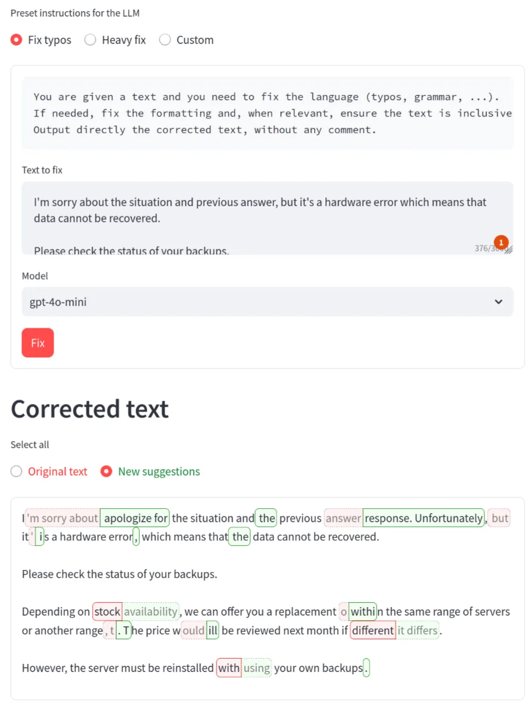

# LLM Typo Fixer

It's simple.
1. You input a text
2. An LLM rewrites it
3. You see the differences:
    :red[red text is yours], :green[green is suggestions].
4. You click to toggle between the original and new version.
5. Copy-Paste once you're happy!

👉 Find an instance at https://typo-correct.fly.dev/.



## Run locally

The simplest way to run the app locally is using [`pipx`](https://pipxproject.github.io/pipx/).

```bash
pipx install https://github.com/ddorn/typofixer
```
Then the app can be started with `typofixer`.

Note that you need to have the `OPENAI_API_KEY` environment variable set to your OpenAI API key to
use OpenAI models, and `ANTHROPIC_API_KEY` to use the Anthropic models.

## Modify and run locally (or to set up your own instance)

```bash
# Install dependencies with poetry (https://python-poetry.org/)
poetry install
# Run the app
poetry run streamlit run typo_fixer/main.py
```

### Tracking usage

There are two ways to track usage: with a log file or with a Directus database.

The log file is set up by default to track usage, but is disabled if Directus is enabled.

#### Directus Logging and Schema Export

I'm tracking usage of the app with a [Directus](https://directus.io/) self-hosted database. It might not be the best decision, but I wanted to try it.

The shema for the directus database is defined in [directus_schema.json](./typos_web/directus_schema.json). Connecting to the database is with 4 environment variables:
- `DIRECTUS_DOMAIN`: Your Directus instance domain (e.g. `https://directus.example.com`), without trailing slash.
- `DIRECTUS_TOKEN`: Your Directus API token with read and write permissions for the collection.
- `DIRECTUS_COLLECTION`: The collection name for logging (default is `typofixer_requests`).
- `DIRECTUS_DISABLE`: Optianal, set to disable logging.

### Max usage

You can set the `MAX_30_DAY_COST` environment variable to limit the usage of the app. The cost is a float number of dollars. The app will stop serving requests once the cost of the requests in the last 30 days exceeds this value. If set to a negative number, the app will not limit the usage.
